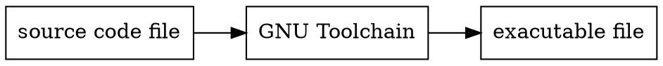
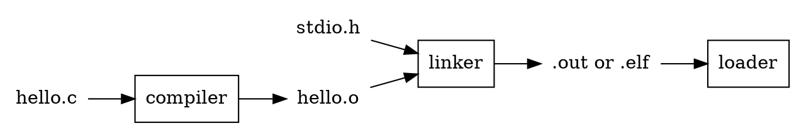

# [Lab2: RISC-V Toolchain](https://hackmd.io/@maromaSamsa/rJFkoUiNj)
###### tags: `computer-arch`, `jserv`
[GitHub Link](https://github.com/maromaSamsa/Computer_Arch2022/tree/main/Lab2_RISC-V%20Toolchain)

## Aim of this lab
[Assignment2: RISC-V Toolchain](https://hackmd.io/@sysprog/2022-arch-homework2)

 - Write a RISCV code that has fewer CSR cycles than c compiler does.
 - ELF


## Before starting...
I would like to know a little bit concept of **GNU Toolchain for RISC-V**, and familiar with it. Therefore, I followed the instruction from the requirement of the assignment:
> Do not duplicate workspaces or the entire repository from rv32emu. As a starting point, copy the [`asm-hello`](https://github.com/sysprog21/rv32emu/tree/master/tests/asm-hello) directory instead. You shall modify Makefile and the linker script accordingly.

:::warning
The meaning of term "GNU Toolchain" in my mind so far:


In GNU Toolchain

Ref: [wikipedia](https://en.wikipedia.org/wiki/Toolchain)
:::

**How to compile (including assemble) and link the file would be my objective in this setion.**

### hello.s
```rust=
# RISC-V assembly program to print "Hello World!" to stdout.

.org 0
# Provide program starting address to linker
.global _start

/* newlib system calls */
.set SYSEXIT,  93
.set SYSWRITE, 64

.data
str: .ascii "Hello World!\n"
     .set str_size, .-str

.text
_start:
    li t0, 0
    li t1, 5

    # dummy test for jal instruction
.L1:
    jal x0, .L2
.L2:
    nop

loop:
    beq t0, t1, end

    li a7, SYSWRITE     # "write" syscall
    li a0, 1            # 1 = standard output (stdout)
    la a1, str          # load address of hello string
    li a2, str_size     # length of hello string
    ecall               # invoke syscall to print the string
    addi t0, t0, 1
    j loop

end:
    li a7, SYSEXIT      # "exit" syscall
    add a0, x0, 0       # Use 0 return code
    ecall               # invoke syscall to terminate the program
```

:::danger
Question:
1. what is `.org` in line 3?
2. meaning of .set str_size, .-str in line 13 (seems like str_size = len(str))
:::
:::success
For instructions using `ecall`, it follows the [document](https://github.com/sysprog21/rv32emu/blob/master/docs/syscall.md) if we want it runs in rv32emu. 

```rust = 
ecall a7, a0, a1 
a7 = 64 -> write
a7 = 93 -> exit
```
meaning that the syscall number is in register x17 (i.e., a7) and, optionally, the first and second parameters to the syscall are in registers x10 (i.e., a0) and x11 (i.e., a1), respectively.
:::

Run the code:
```shell=
#(current path: rv32emu/tests/asm-h
$ make
riscv-none-elf-as -R -march=rv32i -mabi=ilp32 -o hello.o hello.S
riscv-none-elf-ld -o hello.elf -T hello.ld --oformat=elf32-littleriscv hello.o
$ ../../build/rv32emu hello.elf 
Hello World!
Hello World!
Hello World!
Hello World!
Hello World!
inferior exit code 0
$
```
:::warning
Content of Makefile had indacate file hello.ld, was it the instance for program loader?
:::
    

## Problem picked from [黃榆哲](https://hackmd.io/@n7MIa9jgToeqs2aY5BaKEA/Hk3B5RUZo)
[leetcode 121. Best Time to Buy and Sell Stock](https://leetcode.com/problems/best-time-to-buy-and-sell-stock/)

**`Motivation`**: 
> The RISC-V code written by the author did not call a method as a function, which doesn't handle return address `ra`, and the order in which the registers are used is also different from what the specification recommends, makes me want to modify.


### Original c code 
```c=
#include<stdio.h>

int maxProfit(int *prices, int pricesSize)
{
    int i, temp = prices[0], target = 0;
    for (i = 1; i < pricesSize; i++) 
    {
        if (prices[i] > temp) {
            target = (prices[i] - temp > target) ? (prices[i] - temp) : target;
        } else
            temp = prices[i];
    }
    return target;
}

int main(){
	int prices_1[6] = {7, 1, 5, 3, 6, 4};
	int prices_2[4] = {1, 1, 3, 4};
	int prices_3[5] = {7, 5, 4, 3, 2};
	int pricesSize_1 = 6;
	int pricesSize_2 = 4;
	int pricesSize_3 = 5;
	printf("%d\n", maxProfit(prices_1,pricesSize_1));
	printf("%d\n", maxProfit(prices_2,pricesSize_2));
	printf("%d\n", maxProfit(prices_3,pricesSize_3));
	return 0;
}
```
For the algorithm of `maxProfit`, it iterates all the prices and do two things:
1. Find the lowest prices in the history, set the price to `temp`, assume it as a buy time

2. If current price is higher than `temp`, than estimate the profit we would gain if we sell on current price.

**Time Complexity = $O(n)$, *which $n$ is length of prices***

:::info
In line 9, maybe we can set a varible `profit` save the result of `prices[i] - temp
```c=
# target = (prices[i] - temp > target) ? (prices[i] - temp) : target;
int profit = prices[i] - temp;
target = (profit > target) ? profit : target;
```
So that we don't have to calculate the profit twice, and easy to read.
:::

### RISC-V code
We introduce 3 types of code here: 
 - `c_fastOpt.s`: the RISC-V code produced by [GNU Toolchain for RISC-V](https://xpack.github.io/riscv-none-elf-gcc/#-march-and--mabi)
 - `org_asm.s`: RISC-V code written by the original author
 - `my_asm.s`: RISC-V code written by my self, based on `org_asm.s`

#### [GNU Toolchain for RISC-V](https://xpack.github.io/riscv-none-elf-gcc/#-march-and--mabi)
Several shell command are used for compile the source code and generate .elf file, most of those had been written into [makefile](https://github.com/maromaSamsa/Computer_Arch2022/blob/main/Lab2_RISC-V%20Toolchain/Origin%20code/Makefile) as a script.

#### c_fastOpt.s
You can choose the options of optimization when generateing c code to RISC-V code
> -O1, -O2, -O3, -Os, -Ofast
> In this practice, we choose `-Ofast` in hope to generate the program has the fewest CSR cycles.
```shell=
## path: ~/Computer_Arch2022/Lab2_RISC-V Toolchain/Origin code
$ make
## riscv-none-elf-gcc -march=rv32i -mabi=ilp32 -o org_asm.elf org_asm.s
riscv-none-elf-gcc -march=rv32i -mabi=ilp32 -Ofast -o c_fastOpt.s -S BestTimeToBuyAndSellStock.c
riscv-none-elf-gcc -march=rv32i -mabi=ilp32 -o c_fastOpt.elf c_fastOpt.s
```
:::spoiler **Full code(click me)**
```rust=
.file	"BestTimeToBuyAndSellStock.c"
	.option nopic
	.attribute arch, "rv32i2p1"
	.attribute unaligned_access, 0
	.attribute stack_align, 16
	.text
	.align	2
	.globl	maxProfit
	.type	maxProfit, @function
maxProfit:
	li	a5,1
	lw	a3,0(a0)
	ble	a1,a5,.L6
	slli	a1,a1,2
	addi	a5,a0,4
	add	a2,a0,a1
	li	a0,0
	j	.L5
.L11:
	bge	a0,a1,.L3
	mv	a0,a1
.L3:
	addi	a5,a5,4
	beq	a5,a2,.L10
.L5:
	lw	a4,0(a5)
	sub	a1,a4,a3
	blt	a3,a4,.L11
	addi	a5,a5,4
	mv	a3,a4
	bne	a5,a2,.L5
.L10:
	ret
.L6:
	li	a0,0
	ret
	.size	maxProfit, .-maxProfit
	.section	.rodata.str1.4,"aMS",@progbits,1
	.align	2
.LC3:
	.string	"%d\n"
	.section	.text.startup,"ax",@progbits
	.align	2
	.globl	main
	.type	main, @function
main:
	addi	sp,sp,-16
	sw	s0,8(sp)
	lui	s0,%hi(.LC3)
	li	a1,5
	addi	a0,s0,%lo(.LC3)
	sw	ra,12(sp)
	call	printf
	li	a1,3
	addi	a0,s0,%lo(.LC3)
	call	printf
	addi	a0,s0,%lo(.LC3)
	li	a1,0
	call	printf
	lw	ra,12(sp)
	lw	s0,8(sp)
	li	a0,0
	addi	sp,sp,16
	jr	ra
	.size	main, .-main
	.ident	"GCC: (xPack GNU RISC-V Embedded GCC x86_64) 12.2.0"
```
:::

::: warning
Some instruction I am not familiar:
```rust=
.file	"BestTimeToBuyAndSellStock.c"
	.option nopic
	.attribute arch, "rv32i2p1"
	.attribute unaligned_access, 0
	.attribute stack_align, 16
	.text
	.align	2
	.globl	maxProfit
	.type	maxProfit, @function

    ...
    ...

.L6:
    ...
    .section	.rodata.str1.4,"aMS",@progbits,1
    ...
```

`printf()` function in C being converted to a interesting RISC-V code:
```c=
int main(){
	printf("%d\n", maxProfit(prices_1,pricesSize_1));
	printf("%d\n", maxProfit(prices_2,pricesSize_2));
	printf("%d\n", maxProfit(prices_3,pricesSize_3));
	return 0;
}
```
```rust=
        ...

.LC3:
	.string	"%d\n"
	.section	.text.startup,"ax",@progbits
	.align	2
	.globl	main
	.type	main, @function
main:
# -------------- test case 1, ans = 5 ------------------
	lui	s0,%hi(.LC3)            # load upper half word to s0
	li	a1,5                    # load imm 5 into a1
	addi	a0,s0,%lo(.LC3)         # add address (s0 + lower half word) of .LC3 into a0
	sw	ra,12(sp)               # push return register into stack
	call	printf
# -------------- test case 2, ans = 3 ------------------
        li	a1,3                    # load imm 3 into a1
	addi	a0,s0,%lo(.LC3)
	call	printf
# -------------- test case 3, ans = 0 ------------------
	addi	a0,s0,%lo(.LC3)
	li	a1,0                    # load imm 0 into a1
	call	printf
```
It seems that the result had already been computed, also there is no indication that `main` ever called `maxPorfit`
:::

#### org_asm.s
```shell=
## path: ~/Computer_Arch2022/Lab2_RISC-V Toolchain/Origin code
$ make
riscv-none-elf-gcc -march=rv32i -mabi=ilp32 -o org_asm.elf org_asm.s
## riscv-none-elf-gcc -march=rv32i -mabi=ilp32 -Ofast -o c_fastOpt.s -S BestTimeToBuyAndSellStock.c
##riscv-none-elf-gcc -march=rv32i -mabi=ilp32 -o c_fastOpt.elf c_fastOpt.s
```
:::spoiler **Full code(click me)**
Register defined:
```
#t0 = i
#t1 = temp
#t2 = arr_count=3
#t3 = arr[i] t3
#t4 = arr[i]-temp t4
#t5 = arr_2
#t6 = arr_3
#a1 = size
#a2 = target 
```
```rust=
.global main

.data
arr1:    .word 7,1,5,3,6,4
arr2:    .word 1,1,3,4
arr3:    .word 7,5,4,3,2

.text
main:  
        addi   t2, t2, 3       #arr_1
        addi   t5, t5, 2       #arr_2
        addi   t6, t6, 1       #arr_3
arr_1:  
        la     s1, arr1        # load arr1 address of prices in s1
        addi   t0, x0, 0       # initialize t0
        addi   a2, x0, 0       # initialize a2
        addi   a1, x0, 6       # store the size of prices in a1
        jal    x1, maxProfit   # next instruction store in rd register 
arr_2:  
        la     s1, arr2        # load arr2 address of prices in s1
        addi   t0, x0, 0       # initialize t0
        addi   a2, x0, 0       # initialize a2
        addi   a1, x0, 4       # store the size of prices in a1
        jal    x1, maxProfit    # next instruction store in rd register  
arr_3:
        la     s1, arr3        # load arr2 address of prices in s1
        addi   t0, x0, 0       # initialize t0
        addi   a2, x0, 0       # initialize a2
        addi   a1, x0, 5       # store the size of prices in a1
        jal    x1, maxProfit    # next instruction store in rd register 
maxProfit: 
        addi   t0, t0,1        # store the 1 in t0
        lw     t1, 0(s1)       # load the prices[0] in t1 
        addi   s1,s1,4         # *(prices++)
        lw     t3, 0(s1)       # load the arr[1] in t3 
        jal    for_loop
for_loop: 
        bge    t0, a1, printf  # t0>=a1 jump end
        blt    t1, t3, if      # t3 > t1 jump to if
        addi   t1, t3, 0       # else temp = arr[i]
        addi   t0, t0, 1       # i++
        addi   s1,s1,4         # *(prices++)   
        lw     t3,0(s1)        # load the arr[i]
        j      for_loop
if:
        sub    t4,t3,t1        # arr[i]-temp
        bge    t4,a2,Target    # t4 >= a2 jump to Target
        addi   t4,t4,0         # else target=target
       
count: 
        addi   t0, t0, 1       # i++
        addi   s1,s1,4         # *(prices++)   
        lw     t3,0(s1)        # load the arr[i]  
        j      for_loop
Target:
        addi   a2,t4,0         # store the prices[i]-temp in t2
        j      count             
printf:
	addi a0, x0, 1	        # stdout output = 1
	addi sp, sp, -4
	addi a2, a2, 48         # ascii code convert int to char
	addi t0, x0, 10         # set t0 a bit mask
	slli t0, t0, 8          # next byte of string is '\n'
	or a2,a2,t0	        # masking
	sw a2, 0(sp)
	mv a1, sp	        # a1 is an int we want to print
        addi    a2, x0, 2       # length of the string (char with newline)      
        li      a7, 64	        # "print string" syscall is 64 in rv32emu
        ecall                   # printf integer
        addi sp, sp, 4
end:
        addi    t2,t2,-1       # arr_count--
        beq     t2,t5,arr_2    # t2!=t5 jump to arr_2
        beq     t2,t6,arr_3    # t2!=t6 jump to arr_3
        addi    a7,x0,93	# "exit" syscall is 93 in rv32emu
        addi	a0, x0, 0	# set ret to 0
        ecall                  # program stop
```
:::

#### my_asm.s
```shell=
## path: ~/Computer_Arch2022/Lab2_RISC-V Toolchain/My asm code
$ make
riscv-none-elf-gcc -march=rv32i -mabi=ilp32 -o my_asm.elf my_asm.s
```
:::spoiler **Full code(click me)**

Algorithm and register we use:
```
# int maxProfit(int *prices, int)
# {
#       init var buy = prices[0]
#       init var profit = 0
#       iter prices[i]{
#               if prices[i] > buy {
#                      var temp = prices[i] - buy
#                      profit =  (temp > profit) ? temp : (nop)
#               } else {
#                       buy = price[i]
#               }
#       }
#       return profit
# }
# a0: ret profit, a1: *prices, a2: length of prices
# t0: i'th price currently, t1: buy price, t2: price[i], t3: temp
```

```rust=
.global main

.data
arr1:    .word 7,1,5,3,6,4
arr2:    .word 1,1,3,4
arr3:    .word 7,5,4,3,2

.text
main:  
arr_1:  
        la     a1, arr1        # load arr1 address of prices in a1
        addi   a2, x0, 6       # store the size of prices in a2
	jal    ra, maxProfit   # next instruction store in rd register 
	
	mv     a2, a0
	jal    ra, printf 
arr_2:  
        la     a1, arr2        # load arr2 address of prices in a1
        addi   a2, x0, 4       # store the size of prices in a2
        jal    ra, maxProfit   # next instruction store in rd register 

	mv     a2, a0
	jal    ra, printf

arr_3:
        la     a1, arr3        # load arr3 address of prices in a1
        addi   a2, x0, 5       # store the size of prices in a2
        jal    ra, maxProfit   # next instruction store in rd register 

	mv     a2, a0
	jal    ra, printf
end:
        addi    a7, x0, 93	# "exit" syscall is 93 in rv32emu
        addi	a0, x0, 0	# set ret to 0
        ecall                  # program stop

maxProfit: 
        lw     t1, 0(a1)       # load the prices[0] in t1 
        addi   a0, x0, 0       # set profit = 0
        addi   t0, x0, 1       # set iter i = 1, that is, start from prices[1]
        addi   a1, a1, 4       # *(prices++)
        lw     t2, 0(a1)       # load the prices[i] in t2
for_loop: 
        bge    t0, a2, end_maxProfit  # t0 >= a2 jump end
        bge    t1, t2, else    # (buy >= price[i]), jump to else
        sub    t3, t2, t1      # temp = price[i] - buy
        bge    a0, t3, iter    # profit >= temp, jump to iter
        mv     a0, t3          # else, profit = temp
        j iter                 # 
else:
        addi   t1, t2, 0       # buy = prices[i]
iter: 
        addi   t0, t0, 1       # ++i
        addi   a1,a1,4         # *(prices++)   
        lw     t2,0(a1)        # load the prices[i] in t2
        j      for_loop   
end_maxProfit: 
        ret
                    
printf:
	addi a0, x0, 1	        # stdout output = 1
	addi sp, sp, -4
	addi a2, a2, 48         # ascii code convert int to char
	addi t0, x0, 10         # set t0 a bit mask
	slli t0, t0, 8          # next byte of string is '\n'
	or a2,a2,t0	        # masking
	sw a2, 0(sp)
	mv a1, sp	        # a1 is an int we want to print
        addi    a2, x0, 2       # length of the string (char with newline)      
        li      a7, 64	        # "print string" syscall is 64 in rv32emu
        ecall                   # printf integer
        addi sp, sp, 4
```
:::

### Comparing size of each .elf
```shell=
$ make elfsize
riscv-none-elf-size [target.elf]
```
```
text	   data	    bss	    dec	    hex	    filename
74648	   2816	    812	  78276	  131c4	    c_fastOpt.elf
1596	   1160	     61	   2817	    b01	    org_asm.elf
1556	   1160	     61	   2777	    ad9	    my_asm.elf
```

### Comparing CSR cycles of each .elf
```shell=
~/rv32emu$ build/rv32emu --stats [target.elf]
```


|                 | c_fastOpt  | org_asm  | my_asm   |
| --------------- | ---------- | -------- | -------- |
| **CSR cycles**  | 3055       | 251      | 325      |

The reason why `my_asm`'s CSR is more than `org.asm`'s is because the `org_asm` combine `maxProfit` and `my_asm` as one  function, that reduce the jump instruction's count in the whole program.

:::success
We had discussed **pipeline hazard** in [Lab1: RV32I Simulator](https://hackmd.io/AjbceBOgQYie0IqhzwXU_w?view#Pipeline-Hazards), knowning that `JUMP` related instruction would cause 2 `NOP` in pipeline, so reducing this kinds of instructions is one of the keys to reduce the CSR counts in the whole program.

See this [commit](https://github.com/maromaSamsa/Computer_Arch2022/commit/14a5d9bd2fd0ee33434414c5f6bd512a883c01c8) combine `printf` and `maxProfit` together to avoid additional `jump and link` instructions, `ret` instruction. Comparing this version with `org_asm` again:

|                 | org_asm  | my_asm   |
| ----------------| -------- | -------- |
| **CSR cycles**  | 251      | 220      |
:::

#### [Unrolling](https://en.wikipedia.org/wiki/Loop_unrolling) technique to boost efficiency
:::warning
This [commit](https://github.com/maromaSamsa/Computer_Arch2022/commit/2eb9c4070d9c024d890e65d7b026c39b50d663e1) implement unrolling but met some unexpected behaviour executing in rv32emu.

expected output is:riscv-none-elf-gcc -march=rv32i -mabi=ilp32 -o my_asm.elf my_asm.s
```shell=
5
3
0
```

run its ELF into rv32emu, output is not correct:


run its ELF into Ripes:


In this [Issue](https://github.com/sysprog21/rv32emu/issues/82), I represent this unexpected output by MRE(minimal reproducible example), and found out that the reason why of the output is about **misalignment**.

Also I realize that rv32emu deosn't implement pipeline.
:::
